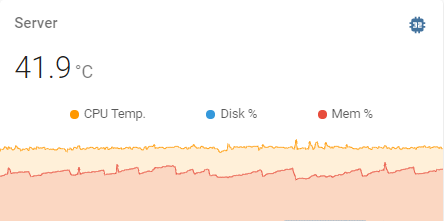
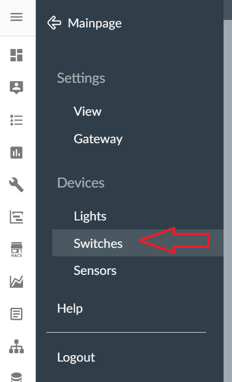
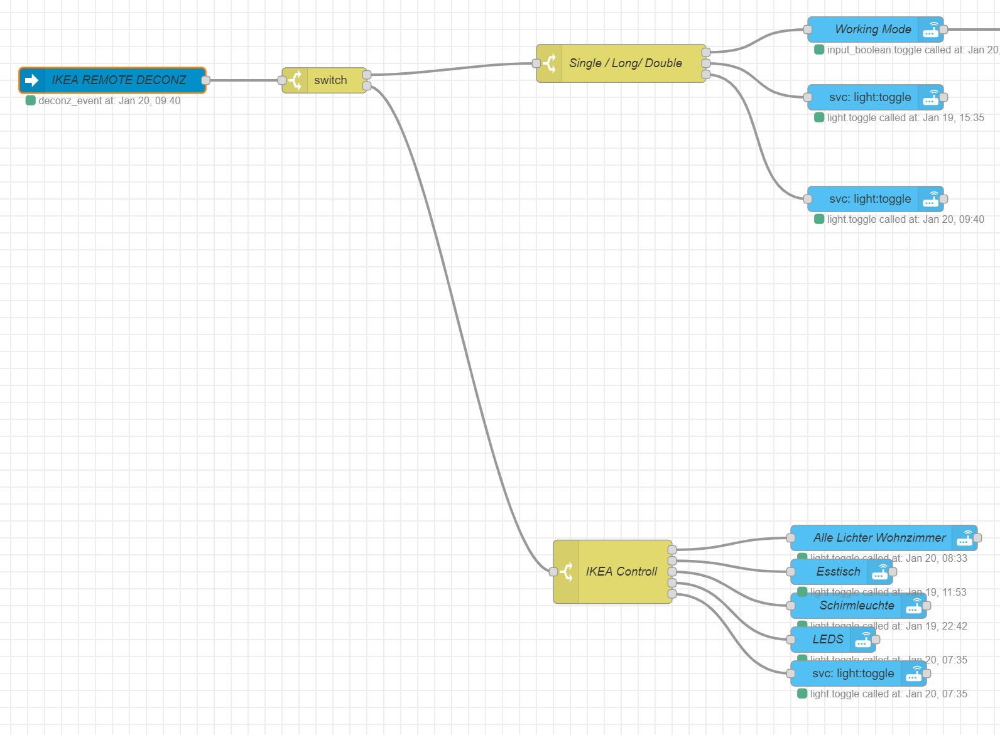

# Rangulvers Smarthome with Homeassistant


<a href="https://www.buymeacoffee.com/rangulvers" target="_blank"></a>

Collection of scripts, tools, hardware and other elements used for our home automation setup. Everything is controlled by my [home assistant](https://www.home-assistant.io/) installation. The following parts will focus on this setup. 

### Reach out to the community if you need help with Homeassistant

[community.home.assistant.io](https://community.home-assistant.io/)
[Discord](https://discord.com/channels/330944238910963714/361518119421739030)

## Software
[home assistant](https://www.home-assistant.io/)


### Addons

Addon |  used for | more information
--- |  --- | ---
DuckDns |  Allow the external login via a custom domain |
Grafana |  The open platform for beautiful analytics and monitoring. |
InfluxDB |  Scalable datastore for metrics, events, and real-time analytics. |
Log Viewer |  Browser-based log utility for Home Assistant. |
NGINX |  An SSL/TLS proxy. To split traffic between internal and external  |
Node-Red |  Flow-based programming for the Internet of Things. |
UniFi Controller | Manage your UniFi network using a web browser. |
deConz | Control Zigbee network 
  
### Integrations

Integration | used for | more information
--- |--- | ---
Google Cast  | Change light scene when anything is playing on the chrome cast |
HACS  | install of custom integrations |
Home Connect  |  |
Nibe  | Collect usage information about our heating system |
Reolink | Security :smile: |[Reolink](https://github.com/fwestenberg/reolink_dev)
Shelly  | Controll different lights and some custom builds listed below |
Speedtest  |  |
Unifi  | Control all Access Points and used for "Home" information |
Zigbee (ZHA)  | Manage and control all ZigBee devices  |
Mobile App | |
MQTT ||
Signal | Notification and interaction via chat commands |  [Signal Rest API CLI](https://github.com/bbernhard/signal-cli-rest-api/blob/master/doc/HOMEASSISTANT.md)

## Hardware

### The brain

Everything is running on a Raspberry PI 4 [link](https://www.amazon.de/Raspberry-Pi-ARM-Cortex-A72-Bluetooth-Micro-HDMI/dp/B07TC2BK1X/ref=sxts_sxwds-bia-wc-p13n1_0?adgrpid=70762780283&cv_ct_cx=raspberry+pi+4&dchild=1&gclid=Cj0KCQiAhs79BRD0ARIsAC6XpaVwlOQdd5mw_bwf6e5xMAyySUobhpqzcAI24BbjxlNVSjHTf2_POM8aArT7EALw_wcB&hvadid=352854576614&hvdev=c&hvlocphy=9041983&hvnetw=g&hvqmt=e&hvrand=3613656398060616438&hvtargid=kwd-297124344473&hydadcr=8207_1722838&keywords=raspberry+pi+4&pd_rd_i=B07TC2BK1X&pd_rd_r=a2d9be5f-034a-40e0-ac72-739b15f88466&pd_rd_w=NwjsC&pd_rd_wg=aMne9&pf_rd_p=62eb0a5a-7892-4776-9eb7-4ce13a045c59&pf_rd_r=NWRPERZQ99WGD72NXMGX&psc=1&qid=1605617162&quartzVehicle=812-409&replacementKeywords=raspberry+pi&sr=1-1-79e1db8b-ac0e-4e53-86a0-e4b4f9bb89cd&tag=googhydr08-21)

### Gateways and hubs

Vendor | Count | Type | Used For | More Information
--- | --- | --- | --- | ---
deConz| 1 | Conbee2 | Handle all Zigbee communication | [conbee2](https://phoscon.de/de/conbee2/)
Sonoff ZBBridge | 1 | This is not used anymore since I moved all my devices to the conbee2 stick | [link](https://www.itead.cc/sonoff-zbbridge.html)
IKEA Gateway | 1 | | This is not used anymore since I moved all IKEA lights to my regular Zigbee Network powered by the Sonoff Zigbee Bridge |
LIDL Gateway |1| | This is not used anymore since I moved all Lidl lights to my regular Zigbee Network

### Sensors

Vendor | Count |Type | Used For | More Information
--- | --- | --- | --- | ---
Sonoff | 1 | SNZB-01 | Wireless switch |
Sonoff | 2 |SNZB-02 | temperature and humidity |
Sonoff | 2 |SNZB-03 | motion sensor |
Sonoff | 2 |SNZB-04 | Window and door sensor |
Aqara  | 2 |RTCGQ11LM | Motion Sensor |[link](https://www.aqara.com/eu/motion_sensor.html)
Aqara | 1  | DJT11LM | Vibration Sensor | [link](https://www.aqara.com/eu/vibration_sensor.html) This is not used anymore since I cannot get it to work as it should
Lidl | 2 | Silvercrest | Window and door sensor | [link](https://www.lidl.de/de/silvercrest-tuer-fensterkontakt-zigbee-smart-home/p355043)

### Switches

Vendor | Count| Type | Used For | More Information
--- | --- | --- | --- | ---
Shelly | 9 | 1  | Control different lights and custom setups | [link](https://shelly.cloud/products/shelly-1-smart-home-automation-relay/)
Shelly | 2 |2.5  | Control different lights and custom setups |  [link](https://shelly.cloud/products/shelly-25-smart-home-automation-relay/)

### Lights

Vendor | Count |Type | Used For | More Information
--- | ---  | ---|--- | ---
IKEA TRADFRI | 8 | E27 CWS opal 600lm | Indoor lights | [link](https://www.ikea.com/de/de/p/tradfri-led-leuchtmittel-e27-600-lm-kabellos-dimmbar-farb-und-weissspektrum-farb-und-weissspektrum-rund-opalweiss-00408612/)
Lidl | 2 | LED-Strip | | [link](https://www.lidl.de/de/livarno-lux-led-band-zigbee-smart-home-individuell-teilbar-selbsthaftend/p354570)
Lidl | 1 | Xmas Lights | | [link](https://www.lidl.de/de/melinera-lichterkette-zigbee-smart-home/p360021)
Lidl | 1 | Smartplug |  |
Osram | 5 | SmartPlug+ | Extend  | 

### Network

Vendor | Count | Type | Used For | More Information
--- | --- | --- |--- | ---
Netgear | 1 |16-Port POE | Switch | [link](https://www.amazon.de/Netgear-JGS516PE-100EUS-16-Port-ProSAFE-Managed/dp/B00F3XSLWI/ref=sr_1_5?__mk_de_DE=%C3%85M%C3%85%C5%BD%C3%95%C3%91&crid=2S0I128KF7QT1&dchild=1&keywords=netgear+poe+16+port&qid=1605617897&s=computers&sprefix=netgear+poe+16%2Ccomputers%2C174&sr=1-5)
Ubiquiti | 2 | UAP-AC-Lite | Access point | [link](https://www.amazon.de/gp/product/B016K4GQVG/ref=ox_sc_saved_image_1?smid=A3JWKAKR8XB7XF&psc=1)
Ubiquiti | 1 | UAP-AC-PRO | Access point | [link](https://www.amazon.de/gp/product/B016XYQ3WK/ref=ox_sc_saved_image_2?smid=A3JWKAKR8XB7XF&psc=1)

### Cameras

Vendor | Count |Type | Used For | More Information
--- | --- | --- | --- | ---
Reolink | Secret :wink: |RLC-511w | Driveway and Garden  | [link](https://reolink.com/de/product/rlc-511w/)

## Home Automation

### deConz / Conbee2 / Phoscon 

Setting up deConz together with the conbee2 stick has been straight forward. Connect the conbee2 to the Raspberry and install the deConz Addon from Homeassistant. The only issue I had was to get the gateway setup correct. But this was more my fault. RTFM helps a lot. After the addon is installed and you managed to add your gateway, open up the phoscon app and start adding your devices. I like the option to already assign them into groups within phoscon and be able to use those same groups again in Homeassistant. Since they will be added as a ``` light ``` group. 

The deConz app is a great help in understanding your Zigbee network and see how well the devices are connected. I had an issue with one of my lights going offline a lot. After checking the network map, I saw that it only had one connection to another device. So, I added a smart bulb in the middle and no everything works as it should since the smart bulb expands the network range. 


### Garage Door Sensor

After installing the Hörmann ProMatic3 I wanted to also receive the status of the door to make sure it is closed at night or be alarmed when it is open when it should not be.
To my surprise this has been pretty straight forward.

Since the shelly comes with the 24v-60v DC option active by default there is nothing we need to change

#### **Hardware Setup**

* Connecting the power supply

    The ProMatic3 offers a direct power supply thru the board itself. Just connect

    L(-) -> 20

    N(+) -> 5

    
    

* Open / Close Status Information

    To also get a status about the current state of the gate you need to flip the the DL Button 2 to "ON". This is "OFF" by default
    DL Button 2 controls if the "End position message" should be triggered when the gate is closed
    Just connect the SW to the 0V terminal.

    
    
* Control the door

    I did not connect the O/I ports to control the gate with my shelly. If you also want to control the gate just connect the O/I ports of your shelly to the two terminal ports on the right (open in my picture). The order does not matter

#### **Homeassistant integration**

If you now connect your shelly to HA you will receive the status and can control your gate. There is only one issue. The information is somewhat misleading in HA since it will show "ON" for closed and "OFF" for open.
To fix that you can open up the Shelly App and change the setting "Reverse Input"

I also added a custom binary sensor to translate ON and OFF to OPEN and Close

```yaml
 - platform: template
    sensors:
      sensor_name:
        value_template: '
          
            Open
          
            Closed
          
          
          n/a
          '
        friendly_name: 'friendly sensor name'
```


### Doorbell notification with Balter EVO-7M

See also  [Shelly Creates noise on data link with Halter Doorbell #1](/../../issues/1)

After installing my Balter Doorbell system I realized that the doorbell sound of both monitors in the living room and upstairs floor is not loud enough to notify me in my office located in the basement. After reading the documentation I realized that I can use the external bell output to trigger a shelly switch.

This has to be connected to the main monitor of the system otherwise it won't work.


In Homeassistant I also created a Node-Red flow to notify me when someone is at the door and to flash the lights in my office 5 times.
With the notification I also get a snapshot of my camera aimed at the door. This can be done in two ways:

1. call the ```camera.snapshot``` service when you receive the trigger from the doorbell shelly
2. use the get entities node for the camera to extract the "entity_picture" attribute.

In both cases you must use a function node to prep the message to be send

```js
msg.payload = {
  "data":{
    "title":"Doorbell",
    "message": "Someone is at the door",
    "data":{
      "ttl":0,
      "priority": "high",
      "channel": "Motion",
      "importance": "high",
      "ledColor": "red",
      "image":"https://youripordomain"+msg.data.attributes.entity_picture
    }
  }
}
return msg;
```


### Office Morning routine

My office is setup with

* Shelly 1 for the ceiling light
* Lidl LED Strip around a framed picture
* IKEA Light Bulb as a desk light
* OSRAM Smart Plug+ to control a standing light
* Aqara Motion sensor next to the door

When I walk into the office the motion sensor (PIR) is triggered and turns on all lights in my office. I also make use of the [FLUX](https://www.home-assistant.io/integrations/flux/) addon to generate a more natural light during the day.

The lights stay on as long I'm in my office. This is done via the access point that has a special WIFI just for my office. If my phone changes back to our normal WIFI when leaving the office all lights are turned off and the motion sensor returns to its default state. 

I also added a the Sonoff SNZB-01 to control some custom light scenes. 

* Single press  : cycle thru all scenes setup for my office. (Working, Hangout, Gaming, Reading) 
* Double press  : toggle all lights on or off. 
* Long press    : dim lights to 50% 

See more [details](#zigbee-buttons-with-deconz-and-homeassistant) on how to use ZigBee Buttons with deConz and Homeassistant

### Alarm Mode and Presence Faker

#### **Alarm Mode**

One great use case for automation is the alarm mode. The mode turns on by itself when the house is empty based on the device trackers. If any of the motion, door, window or vibration sensors is triggered with the mode activated

- all lights in our house are turned on to full brightness
- the outdoor lights turn on as well and start blinking rapidly to drawn attention
- all cameras start recording
- a notification is sent to my phone
- and to add a little bit of extra to it -> the smart speakers start playing a very unpleasant noice.

#### **Presence Faker**

To add a small layer of security I also added the [node-red-contrib-presence-faker](https://flows.nodered.org/node/node-red-contrib-presence-faker) node. This will turn on and off random lights in the house when we are away.

#### **Kitchen Lights**

In my kitchen I have installed the Sonoff BASICZBR3 to control the countertop lights. They are paired with the Sonoff motion sensor and will turn of after no motion is detected unless I also turn on the main kitchen light. If I turn of the main light the countertop lights also turn off.

#### **Network Monitoring**

This is more of a gimmick showing me the current network status using the speedtest.net cli integration

#### **Server Monitoring**

To make sure that my server is feeling well and will not hang itself on the cat cable I use the system health integration

```yaml
system_health:
sensor:
  - platform: systemmonitor
    resources:
      - type: disk_use_percent
      - type: disk_use
      - type: disk_free
      - type: memory_use_percent
      - type: load_15m
      - type: last_boot
      - type: processor_temperature
```



### ZigBee Buttons with deConz and Homeassistant

Adding lights or outlets to your installation is pretty easy, but what about button and switches? It is almost as easy but takes a couple of steps to get everything working as you wish. 

1. Add your buttons and switches thru the phoscon app by clicking on ```switches``` and then on ```Add new switch```


2. The pairing will start and you will need to set your switch into pairing mode. 

3. After the pairing is done, go back into your HA view and look for the switch. It is important to note that a switch will not show any state change that you can use. 

4. To still be able to use the switch you need to react to the event of the switch send to the event bus. To find the event go the the developer tools and listen to the ```deconz_event```. This should look something like this

```json
{
    "event_type": "deconz_event",
    "data": {
        "id": "office_work_switch",
        "unique_id": "00:12:4b:00:22:29:41:b0",
        "event": 1004,
        "device_id": "edaab2525312c6e5d15851af28328106"
    },
    "origin": "LOCAL",
    "time_fired": "2021-01-20T08:40:59.909382+00:00",
    "context": {
        "id": "37db6e5c382a00cd12232ceac7970f3c",
        "parent_id": null,
        "user_id": null
    }
}
```

As you can see the event shows up with ``` "event": 1004 ```. You will have to note down the numbers to move forward
For the Sonoff SNZB-01 will give you the following events
* 1002 -> Single Press
* 1003 -> Long Press
* 1004 -> double Press

5. You can now create your automation based on those information. Since I use more than one button and wanted to manage all actions in one view, I'm using node-red for this. 

Create a "events: all" node and under event type select the ```deconz_event```. 
Next add a switch node to seperate the events by device id
Now you can add another switch node after on each output to define the different button actions. 



### Fun Stuff

After playing around with my overall setup for a while I thought it would be time to also have some fun with my smart home. For this I have created python script to control all Shelly’s (that are connected to a light) to turn on and off in sync to the music. You can find the projekt here [rangulvers/shelly_music](https://github.com/rangulvers/shelly_music)
