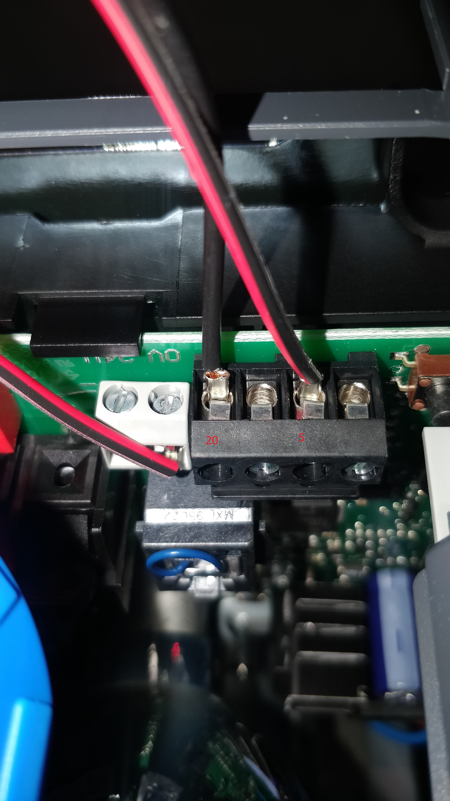
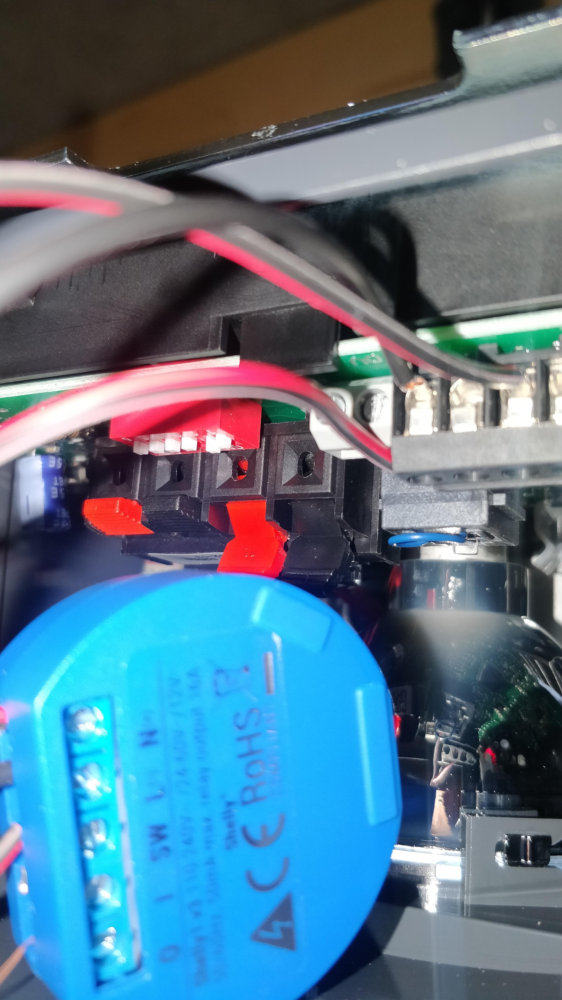
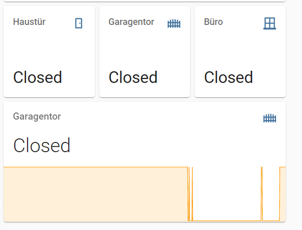
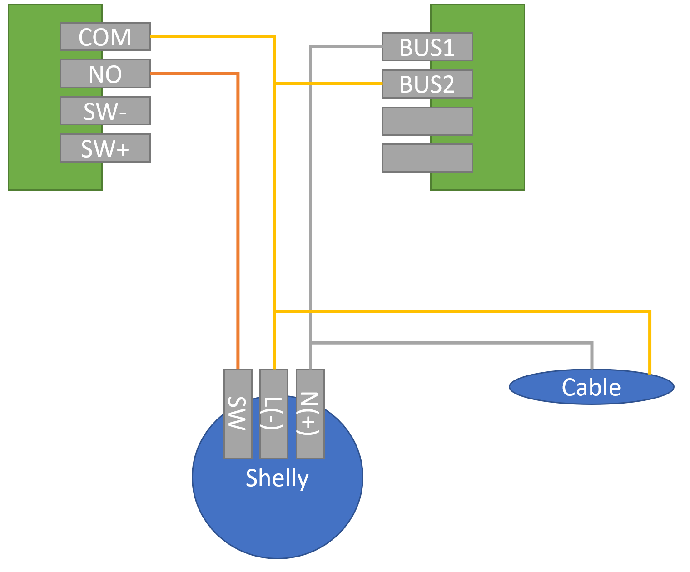
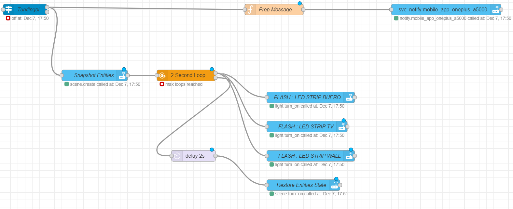

Collection of scripts, tools, hardware and other elements used for our home automation setup. Everything centers around Homeassistant running on a Raspberry PI 4


- [Home Automation](#home-automation)
  - [Garage Door Sensor](#garage-door-sensor)
    - [Hardware Setup](#hardware-setup)
    - [Homeassistant integration](#homeassistant-integration)
  - [Doorbell notification with Balter EVO-7M](#doorbell-notification-with-balter-evo-7m)
  - [Office Morning routine](#office-morning-routine)
  - [Alarm Mode and Presence Faker](#alarm-mode-and-presence-faker)
    - [Alarm Mode](#alarm-mode)
    - [Presence Faker](#presence-faker)
    - [Kitchen Lights](#kitchen-lights)

## Software 

I am running Home Assistant with Version

* Operating System Home Assistant OS 5.8  
* Supervisor Version 2020.12.6
  
### Integrations

Integration | Icon |used for | more information
--- | --- |--- | ---
Google Cast | [logo]: https://brands.home-assistant.io/cast/logo.png "Chrome Cast"
HACS|
Home Connect |
NIBE|
Reolink||[Reolink](https://github.com/fwestenberg/reolink_dev)
Shelly|
Speedtest|
IKEA|
UBIQUITI|
Zigbee (ZHA)|
Mobile App|
MQTT|

## Hardware

### Sensors and Automation
* Raspberry PI 4  [link](https://www.amazon.de/Raspberry-Pi-ARM-Cortex-A72-Bluetooth-Micro-HDMI/dp/B07TC2BK1X/ref=sxts_sxwds-bia-wc-p13n1_0?adgrpid=70762780283&cv_ct_cx=raspberry+pi+4&dchild=1&gclid=Cj0KCQiAhs79BRD0ARIsAC6XpaVwlOQdd5mw_bwf6e5xMAyySUobhpqzcAI24BbjxlNVSjHTf2_POM8aArT7EALw_wcB&hvadid=352854576614&hvdev=c&hvlocphy=9041983&hvnetw=g&hvqmt=e&hvrand=3613656398060616438&hvtargid=kwd-297124344473&hydadcr=8207_1722838&keywords=raspberry+pi+4&pd_rd_i=B07TC2BK1X&pd_rd_r=a2d9be5f-034a-40e0-ac72-739b15f88466&pd_rd_w=NwjsC&pd_rd_wg=aMne9&pf_rd_p=62eb0a5a-7892-4776-9eb7-4ce13a045c59&pf_rd_r=NWRPERZQ99WGD72NXMGX&psc=1&qid=1605617162&quartzVehicle=812-409&replacementKeywords=raspberry+pi&sr=1-1-79e1db8b-ac0e-4e53-86a0-e4b4f9bb89cd&tag=googhydr08-21) 
* Shelly 1 [link](https://shelly.cloud/products/shelly-1-smart-home-automation-relay/)
* Shelly 2.5  [link](https://shelly.cloud/products/shelly-25-smart-home-automation-relay/)
* Sonoff Zigbee Brdige to add Zigbee devices [link](https://www.itead.cc/sonoff-zbbridge.html) 
* Sonoff Zigbee Wirless Switch
* Sonoff Zigbee Temperatue and humidity Sensor
* Sonoff Zigbee Motion Sensor
* Sonoff Zigbee Wireless door / window sensor
* Aqara Motion Sensor [link](https://www.aqara.com/eu/motion_sensor.html)
* Aqare Vibration Sensor [link](https://www.aqara.com/eu/vibration_sensor.html)
* Lidl Zigbee Door Sensor

### Gateways and hubs

Vendor | Type | Used For | More Information
--- | --- | --- | ---
Sonoff |
IKEA Gateway | | This is not used anymore since I moved all IKEA lights to my regular Zigbee Network powered by the Sonoff Zigbee Bridge |
LIDL Gateway | | This is not used anymore since I moved all Lidl lights to my regular Zigbee Network

### Lights

Vendor | Type | Used For | More Information
--- | --- | --- | ---
IKEA TRADFRI | E27 CWS opal 600lm | Indoor lights | [link](https://www.ikea.com/de/de/p/tradfri-led-leuchtmittel-e27-600-lm-kabellos-dimmbar-farb-und-weissspektrum-farb-und-weissspektrum-rund-opalweiss-00408612/)
Lidl | LED-Strip | | [link](https://www.lidl.de/de/livarno-lux-led-band-zigbee-smart-home-individuell-teilbar-selbsthaftend/p354570)
Lidl | Xmas Lights | | [link](https://www.lidl.de/de/melinera-lichterkette-zigbee-smart-home/p360021)
Lidl | Smartplug | |

### Network
Vendor | Type | Used For | More Information
--- | --- | --- | ---
Netgear | 16-Port POE | Switch | [link](https://www.amazon.de/Netgear-JGS516PE-100EUS-16-Port-ProSAFE-Managed/dp/B00F3XSLWI/ref=sr_1_5?__mk_de_DE=%C3%85M%C3%85%C5%BD%C3%95%C3%91&crid=2S0I128KF7QT1&dchild=1&keywords=netgear+poe+16+port&qid=1605617897&s=computers&sprefix=netgear+poe+16%2Ccomputers%2C174&sr=1-5)
Ubiquiti | UAP-AC-Lite | Access point | [link](https://www.amazon.de/gp/product/B016K4GQVG/ref=ox_sc_saved_image_1?smid=A3JWKAKR8XB7XF&psc=1)
Ubiquiti | UAP-AC-PRO | Access point | [link](https://www.amazon.de/gp/product/B016XYQ3WK/ref=ox_sc_saved_image_2?smid=A3JWKAKR8XB7XF&psc=1)

### Cameras
Vendor | Type | Used For | More Information
--- | --- | --- | ---
Reolink | RLC-511w | Driveway and Garden  | [link](https://reolink.com/de/product/rlc-511w/)

# Home Automation 

## Garage Door Sensor

After installing the Hörmann ProMatic3 I wanted to also retrieve the status of the door to make sure it is closed at night or be alarmed when it is opend when it should not be. 
To my suprise this has been pretty straight forward. 

Since the shelly comes with the 24v-60v DC option active by default there is nothing we need to change

### Hardware Setup
* Connecting the power supply

    The ProMatic3 offers a direct powersupply thru the board itself. Just connect 
    
    L(-) -> 20 
    
    N(+) -> 5
    
    
    
* Status

    To also get a status about the current state of the gate you need to flip the the DL Button 2 to "ON". This is "OFF" by default
    DL Button 2 controlls if the "End position message" should be triggered when the gate is closed
    Just connect the SW to the 0V terminal. 
    
    

* Controll

    I did not connect the O/I ports to actually controll the gate with my shelly. If you also want to controll the gate just conncet the O/I ports of your shelly to the two terminal ports on the right (open in my picture). The order does not matter

### Homeassistant integration
If you now connect your shelly to HA you will recieve the status and can controll your gate. There is only one issue. The information is somewhat missleading in HA since it will show "ON" for closed and "OFF" for open. 
To fix that you can open up the Shelly App and change the setting "Reverse Input"

I also added a custom binary sensor to translate ON and OFF to OPEN and Close

```
 - platform: template
    sensors:
      sensor_name:
        value_template: '
          
            Open
          
            Closed
          
          
          n/a
          '
        friendly_name: 'friendly sensor name'
```




## Doorbell notification with Balter EVO-7M 

After installing my Balter Doorbell system I realized that the doorbell sound of both monitors in the living room and upstairs floor is not loud enough to notify me in my office located in the basement. After reading the documentation I realized that I can use the external bell output to trigger a shelly switch. 

This has to be connected to the main monitor of the system otherwise it won't work. 



In Homeassistant I also created a Node-Red flow to notify me when someone is at the door and to flash the lights in my office 5 times. 
With the notification I also get a snapshot of my camera aimed at the door. This can be done in two ways:

1. call the camera.snapshot service when you recieve the trigger from the doorbell shelly
2. use the get entities node for the camera to extract the "entity_picture" attribute. 

In both cases you have to use a function node to prep the message to be send 

```js
msg.payload = {
  "data":{
    "title":"Doorbell",
    "message": "Someone is at the door",
    "data":{
      "ttl":0,
      "priority": "high",
      "channel": "Motion",
      "importance": "high",
      "ledColor": "red",
      "image":"https://youripordomain"+msg.data.attributes.entity_picture
    }
  }
}
return msg;
```




## Office Morning routine

My office is setup with 

   - Shelly 1 for the ceiling light 
   - Lidl LED Strip around a framed picture
   - IKEA Light Bulp as a desk light
   - Aqara Motion sensor next to the door

When I walk into the office the motion detector is triggered and turns on all lights in my office. I also make use of the [FLUX](https://www.home-assistant.io/integrations/flux/) addon to generate a more natural light during the day. 

If the motion sensor does not see any movement for 15 minutes all lights are turned back off again. 

## Alarm Mode and Presence Faker

### Alarm Mode

One great use case for automation is the alarm mode. The mode turns on by itself when the house is empty based on the device trackers. If any of the motion, door, window or vibration sensors is triggered with the mode activated 

- all lights in our house are turned on to full brightness
- the outdoor lights turn on as well and start blinking rapidly to drawn attention
- all cameras start recording 
- a notification is send to my phone
- and to add a little bit of extra to it -> the smart speakers start playing a very unpleasant noice.


### Presence Faker

To add a small layer of security I also added the [node-red-contrib-presence-faker](https://flows.nodered.org/node/node-red-contrib-presence-faker) node. This will turn on and off random lights in the house when we are away. 


### Kitchen Lights

In my kitchen I have installed the Sonoff BASICZBR3 to control the counter top lights. They are paired with the Sonoff motion sensor and will turn of after no motion is detected unless I also turn on the main kitchen light. If I turn of the main light the counter top lights also turn off. 