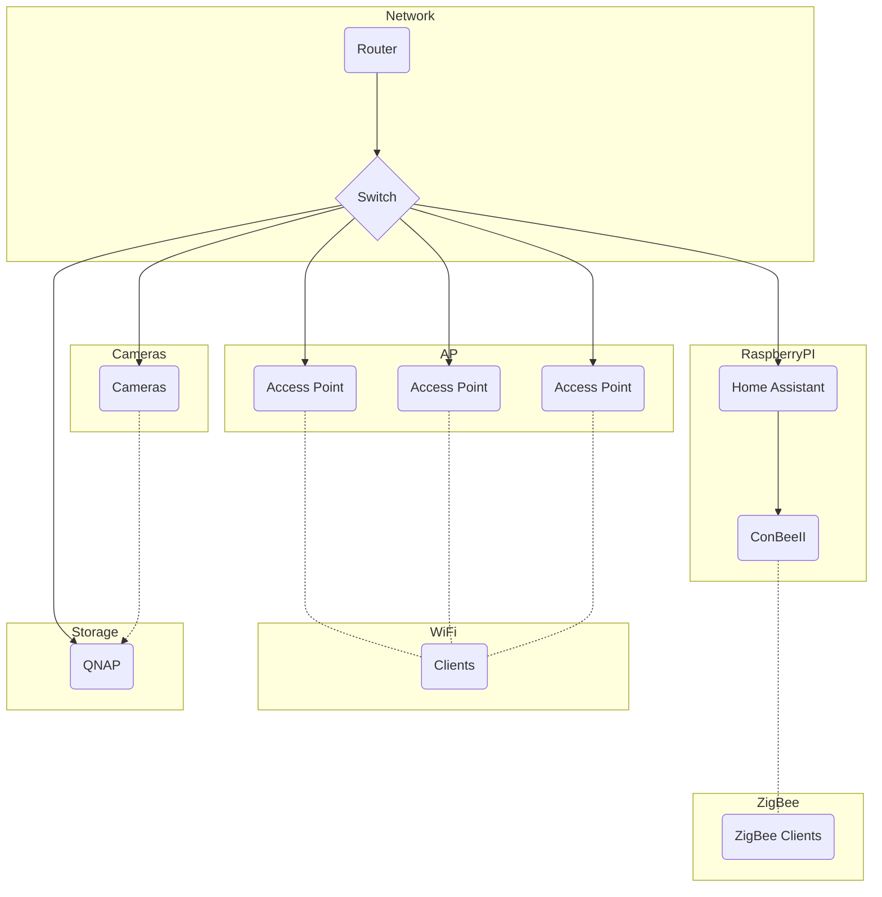

Collection of scripts, tools, hardware and other elements used for our home automation setup. Everything is controlled by my [home assistant](https://www.home-assistant.io/) installation. The following parts will focus on this setup.

### Support

[community.home.assistant.io](https://community.home-assistant.io/)

[Discord](https://discord.com/invite/c5DvZ4e)

